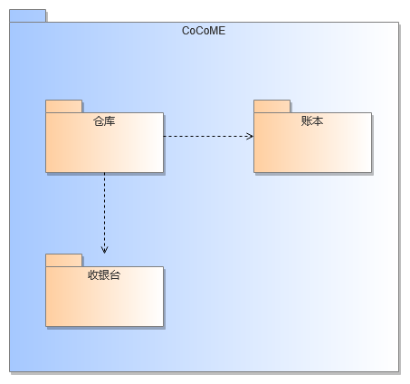
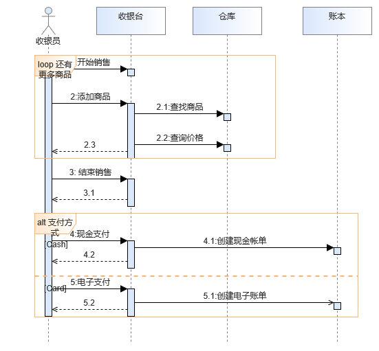
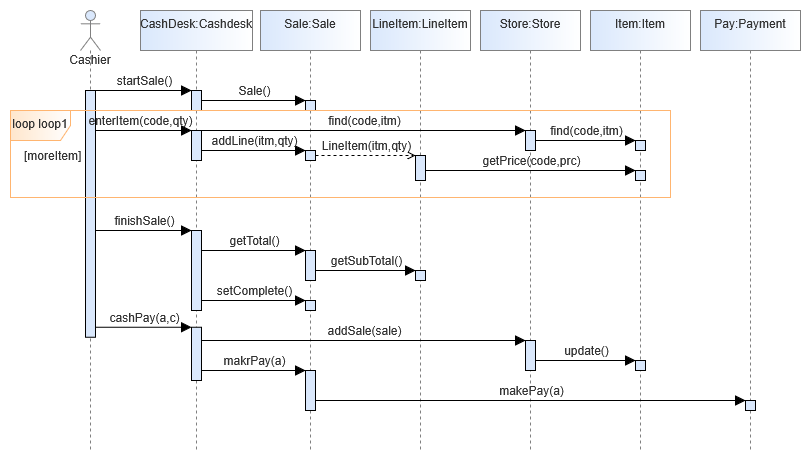
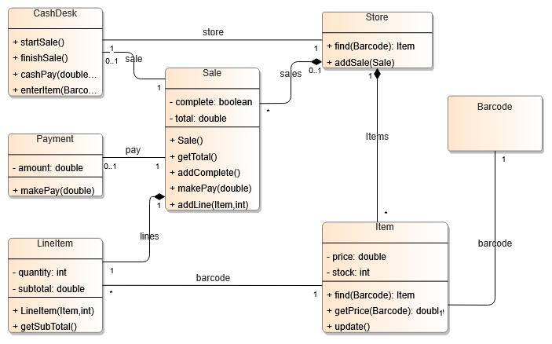
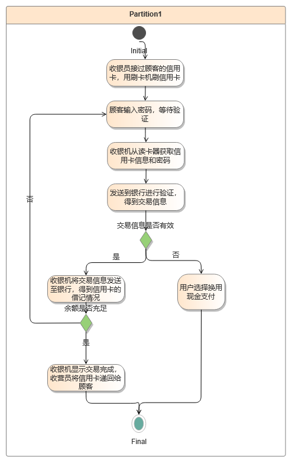

# 软件设计说明书
## 软件体系结构设计

- 收银台子系统：最基本的子系统，能够创建、结束订单，并且循环添加商品，获取商品信息，该功能依赖于仓库子系统。该子系统还负责根据选定支付方式，创建对应账单并完成支付，该功能依赖于账本子系统。
- 账本子系统：负责创建、管理等账单基本活动，包括现金帐单与电子账单两种类型，并能与银行等外部系统进行实时通信，获取支付情况、卡余额等信息，以供收银台校验使用。
- 仓库子系统：负责存储超市商品信息，包括名称、价格、数量等。提供获取商品信息与获取商品价格的接口，以供收银台子系统使用。

## 用例设计

“处理销售”功能的实现依据如下流程：
首先，收银员通过startSale()向CashDesk对象传递服务开始的信息，令其通过Sale()创建一个sale()对象。
随后，不断重复收银员通过enterItem(code,qty)添加商品-CashDesk通过find(code,item)向Store传递商品信息-Store通过find(code,item)查找对应Item，以及CashDesk通过addLine(itm,qty)向Sale传递信息-Sale创建LineItem对象-该对象getPrice(code,prc)得到商品价格的两个过程，直到所有商品录入完毕。收银员通过finishSale()信息，令CashDesk开始下一阶段。CashDesk通过getTotal()从Sale中获取其通过getSubTotal()从LineItem中获取到的商品总数,并且通过setComplete设置Sale为完成状态。
最后，顾客选择刷卡支付，收银员通过cashPay(a,c)设置收银台模式，令其通过addSale(sale)将Sale对象添加到Store当中，并通过update()更新商品信息。收银台利用makePay(a)支付订单Payment。
## 类设计

1. 精化类间的关系

LineItem类负责保存添加后的商品信息名录。在具体实现时，LineItem类通过提供一组服务将Item类的信息保存到后台的数据库之中，因而LineItem类与Item类之间的语义关系表现为一般的关联关系。

一个Item对象可以存在于多个LineItem对象中，一个LineItem对象只能包含一个Item对象，存在一对多关系。

2. 精化类属性的设计

Item类属性的精化设计描述如下。

有二项基本属性：价格"price"，类型为double，库存"stock"，类型为int。

商品的价格和库存属于私有信息，对外部其他类不可见，这两项属性的可见范围为“private”。

价格的初始值为0.0，库存的初始值为0。

3. 精化部分类方法的设计

Item类的方法：find(Barcode)方法从Store类中查找商品信息，获取商品；getPrice(Barcode)方法获取其价格。

Sale类的方法：Sale()创建Sale对象；getTotal()方法获取商品总数与总价；makePay()方法创建订单。

CashDesk类的方法：startSale()方法和finishSale()方法分别开始收银和结束收银总流程。enterItem()方法添加商品；cashPay()方法开始支付流程。

4. 精化类方法的实现算法的设计

活动图中说明了顾客选择刷卡支付时的实现流程。在刷卡信息验证正确/不正确-重新提供直至正确的情况下，以及卡余额不足跳转现金支付的不同情况下，直到交易完成的的流程。

